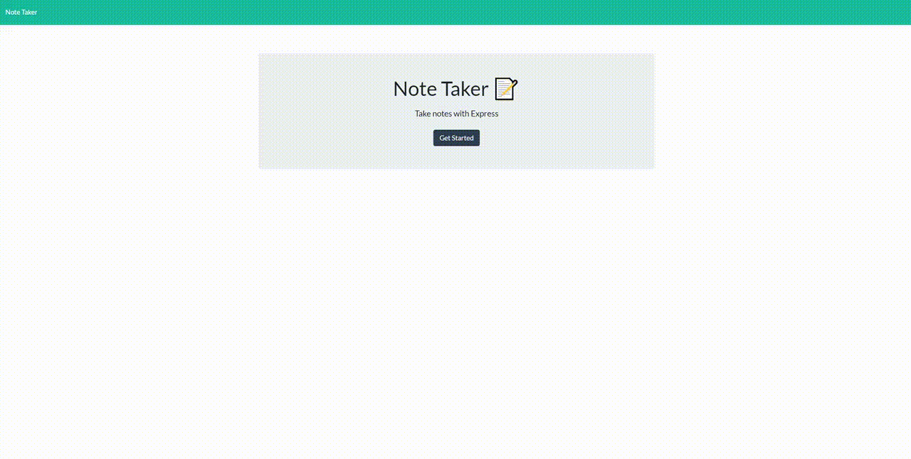

# HW9-Note-Taker

## Description
- Learned about express js and how to apply all aspects of programming from front end to back end along with launching an application publicly. 
- To have a deeper understanding of paths and utilizing the express library.
- Solved problems when it came to understanding the transfer of data from point a to b.
- Better at breaking down and utilizing the methods within express to GET, POST, and DELETE data, along with storing it. 

## Table of Contents (Optional)
- [Installation](#installation)
- [Usage](#usage)
- [License](#license)
- [Features](#features)

## Usage

[Heroku Deployed Application](https://polar-thicket-07958.herokuapp.com/)

## Credits
List your collaborators, if any, with links to their GitHub profiles.
If you used any third-party assets that require attribution, list the creators with links to their primary web presence in this section.
If you followed tutorials, include links to those here as well.
## License

## Features
- Allows user to add title and text for specified notes.
- Allows user to save specific notes.
- Delete notes.
- Access previously written notes.

